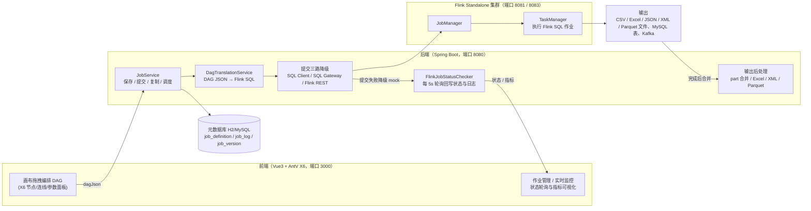

# 数据流任务管理系统（DataStream MVP）

> 基于 **Spring Boot 3.2 + Apache Flink 1.18 + Vue 3 + AntV X6** 的可视化数据流任务编排平台：在画布上拖拽控件搭建 DAG，一键翻译为 Flink 作业并提交 Standalone 集群运行，结果输出到文件或 MySQL。

## 〇、系统架构



## 一、功能特性

- **可视化画布**：AntV X6 拖拽建节点、端口连线、点选配置参数、Delete 键 / 双击删除、保存 / 提交 / 导出 / 导入 JSON、新建画布、清空画布、Ctrl+S 保存。
- **31 个内置控件**：CSV / Excel / JSON / XML / Parquet / HDFS / MySQL / PostgreSQL / Oracle / Kafka / Datagen 输入输出 + Redis 富化、字段拼接、字段过滤、字段改名、行过滤、JSON 解析、XML↔JSON 转换和数据质量控件。
- **作业管理**：状态机 DRAFT → SUBMITTED → RUNNING → COMPLETED / FAILED / CANCELLED（依赖编排另有 WAITING / BLOCKED），Flink 状态每 5s 轮询回写（`app.monitor.status-poll-ms` 可配），日志落库可查。
- **作业复制 / 定时调度**：一键复制作业（名称追加「（副本）」，状态重置 DRAFT）；作业可配置 cron 表达式定时自动提交（JobScheduler 每 30s 扫描，运行中不重复提交）。
- **动态参数面板**：按控件 paramSchema 自动渲染 string / number / boolean / enum / array 类型参数。
- **实时监控面板**：运行中作业每 5s 自动刷新，展示吞吐（行/s）、背压（ok/low/high）、Checkpoint 状态与运行时长（聚合 Flink REST 指标）。
- **数据预览**：点选输入类节点，右侧参数面板点「📊 预览数据」，弹窗展示 CSV / Excel / JSON / XML / TXT 前 N 行（默认 10 行）与字段名，便于提交前确认数据。
- **MySQL 自动建表**：MySQL 输出控件自动建表（utf8mb4、类型映射、中文无乱码）。
- **敏感信息不入库**：MySQL 输入/输出的用户名与密码支持留空或填写占位符 `${MYSQL_USERNAME}` / `${MYSQL_PASSWORD}`，提交/预览时由后端解析环境变量（`.env` 中的 `MYSQL_USERNAME` / `MYSQL_PASSWORD`），DAG JSON 与元数据库中不保存明文密码。
- **已实测链路**：CSV → CSV / Excel / MySQL；Excel → CSV / MySQL；Datagen → CSV / Excel；JSON → JSON；CSV → JSON（字段过滤 / 改名 / 行过滤 / JSON 解析）；CSV → Kafka → CSV；MySQL → CSV；CSV → xml_json → CSV（XML↔JSON 字段级转换，需 UDF jar）；Parquet → CSV / CSV → Parquet（类型自动推断）；多 Sheet Excel 输出（同一 xlsx 多个 sheet）；去重 / 空值校验 / 条件路由（一条流分流到两个输出）。
- **性能基准**：`test-resources/benchmark.py` 真实提交 Flink 作业产出报告（见「性能基准测试」章节）。
- **AI 助手（NL2Pipeline Agent）**：输入自然语言需求（如「读取 sales.csv，把 product_category 和 channel 拼接成新列，写出到 MySQL 表 ai_demo」），DeepSeek 依据控件注册表摘要生成可执行 DAG（仅使用合法控件类型与参数），落库为 DRAFT 作业，人工确认后可打开画布微调并提交运行。
- **告警中心（故障感知）**：每 10s 自动扫描作业失败 / 在线重启超限 / 吞吐归零 / 高背压 / Checkpoint 失败 / 资源超阈值（`app.monitor.health-scan-ms` 可配），15 分钟去重后落库展示，支持邮件 + webhook 通知与恢复闭环，前端带未读角标与已读管理。
- **智能诊断 Agent**：对失败作业一键诊断——本地规则引擎先命中 8 类高频错误（文件不存在、路径乱码、字段配置缺失、Kafka 不可用等），未命中自动调用 DeepSeek 归因，返回根因 / 关键证据 / 修复建议，部分参数可一键修正。

## 二、快速启动

### 方式一：手动启动（推荐）

#### 1. 启动 Flink 集群（提交真实作业前必须启动）

```bat
D:\code\flink-1.18.1\bin\start-cluster.bat
start_sql_gw.bat     :: SQL Gateway（可选）
```

验证：浏览器打开 http://localhost:18081 能看到 Flink Web UI（本机 `flink-conf.yaml` 里 rest.port=18081、SQL Gateway 18083）。

> 注意：Flink 未启动时作业提交走 mock，作业会**停在 SUBMITTED**，不会真正执行也不会自动完成。
> 手工起后端时要让端口对齐：`FLINK_CLUSTER_PORT=18081`、`FLINK_SQL_GATEWAY_PORT=18083`（`start-all.bat` 已自动注入）。

#### 2. 启动后端

```bat
cd backend
mvn spring-boot:run -Dspring-boot.run.jvmArguments="-DFLINK_CLUSTER_PORT=18081 -DFLINK_SQL_GATEWAY_PORT=18083"
```

- 后端地址：http://localhost:8080（`start-all.bat` 一键启动时使用 18080）
- 元数据库（默认 H2）：H2 Web 控制台**默认关闭**；需要时用 `H2_CONSOLE_ENABLED=true` 启动，再以 ADMIN 账号访问 http://localhost:8080/h2-console （JDBC URL `jdbc:h2:file:./data/mvpdb`，用户名 `sa`，密码留空）
- 启动时自动初始化 31 个内置控件
- 首次空库启动前必须在 `.env` 配置 `JWT_SECRET`、启用 `BOOTSTRAP_USERS_ENABLED`，并设置三个角色的初始密码；已有用户库不会重复创建账号

#### 3. 启动前端

```bat
cd frontend
npm run dev        :: 等价于 node serve.js
```

- 前端地址：http://localhost:3000 （serve.js 提供静态服务并反向代理 /api 到后端，端口用 `BACKEND_PORT` 指定，默认 8080）

### 方式二：一键脚本

```bat
start-all.bat
```

> `start-all.bat` 幂等（按端口探活跳过已在跑的服务），依次拉起 Kafka → Flink(JM 18081/TM) → SQL Gateway(18083) → 后端(18080) → 前端(3000)。
> 它**只启动已编译好的 `backend/target/mvp-backend-1.0.0.jar`，不会自动编译**；改过后端代码要先 `cd backend && mvn -DskipTests package`。

> `start-all.bat` 已改为基于脚本自身路径（`%~dp0`）定位后端/前端，不再依赖硬编码中文路径；首次使用前请确认 `FLINK_HOME`（默认 `D:\\code\\flink-1.18.1`）。

### 方式三：Docker 全容器化

```bat
start-docker.bat        :: 一键构建并启动 12 个容器（MySQL / PostgreSQL / Redis / Kafka / HDFS×2 / Flink×3 / 后端 / 前端；Oracle 为可选 profile）
docker compose ps       :: 查看状态，全部应为 healthy
```

详见「六、Docker 部署」。

## 三、使用流程（如何测试）

1. 按「快速启动」依次启动 Flink、后端、前端。
2. 浏览器打开 http://localhost:3000 。
3. 从左侧控件库拖拽「CSV 输入」和「CSV 输出」到画布。
4. 从 CSV 输入节点右侧端口拖线连接到 CSV 输出节点左侧端口。
5. 点选节点，在右侧参数面板填写：
   - CSV 输入 `path`：`D:\code\比赛\2026省服务外包\test-resources\data\sales.csv`
   - CSV 输出 `path`：`D:\code\比赛\2026省服务外包\output\out.csv`
6. （可选）点选输入节点，点右侧参数面板「📊 预览数据」，弹窗查看 CSV / Excel / JSON / XML / TXT 前 10 行，确认数据与字段后再提交。
7. 点击「保存」，再点击「提交运行」。
8. 到 http://localhost:8081 查看 Flink Job 运行状态；到项目根目录 `output/` 查看输出文件。
9. 使用 MySQL 输出控件时，提交成功后在控件配置的库中查看自动创建的表（控件默认库为 `flink_demo`，Docker 编排另建 `datastream`）。

## 四、内置控件（31 个）

| 分类 | type | 说明 | 状态 |
|------|------|------|------|
| 输入 | datagen_input | 内置随机数据生成器 | 可用 |
| 输入 | csv_input | 读取 CSV 文件 | 可用 |
| 输入 | excel_input | 读取 .xls / .xlsx（POI） | 可用 |
| 输入 | kafka_input | 消费 Kafka 主题（支持体验开关 autoStop 自动停止） | 需自建 Kafka |
| 输入 | mysql_input | 读取 MySQL 表（JDBC 自动推导字段） | 可用 |
| 输入 | pg_input | 读取 PostgreSQL 表（JDBC 自动推导字段） | 可用 |
| 输入 | oracle_input | 读取 Oracle 表（JDBC 自动推导字段） | 可用 |
| 输入 | hdfs_input | 读取 HDFS CSV（显式 schema） | 可用 |
| 输入 | json_input | 读取 JSON Lines 文件（fieldsConfig 定义 schema） | 可用 |
| 转换 | field_filter | 只保留指定字段 | 可用 |
| 转换 | field_rename | 字段重命名（old=new） | 可用 |
| 转换 | row_filter | 按条件过滤行（SQL WHERE 表达式） | 可用 |
| 转换 | json_parse | 从 JSON 字段解析多个字段 | 可用 |
| 输出 | json_output | 写 JSON Lines 文件（part 自动合并为单文件） | 可用 |
| 转换 | field_concat | 多字段拼接为新字段 | 可用 |
| 转换 | redis_lookup | 按字段值 GET Redis 并富化新字段 | 需 Redis/UDF jar |
| 转换 | xml_json | XML ↔ JSON 互转 | 需 UDF jar |
| 输出 | csv_output | 写 CSV 文件 | 可用 |
| 输出 | excel_output | 写 .xlsx（临时 CSV + POI 转换） | 可用 |
| 输出 | kafka_output | 写 Kafka 主题 | 需自建 Kafka |
| 输出 | mysql_output | 写 MySQL 表（自动建表 utf8mb4） | 可用 |
| 输出 | pg_output | 写 PostgreSQL 表（可选安全自动建表） | 可用 |
| 输出 | oracle_output | 写 Oracle 表（可选安全自动建表） | 可用 |
| 输出 | hdfs_output | 写 HDFS CSV 目录 | 可用 |
| 输入 | xml_input | 读取 XML 文件（记录列表结构，嵌套子结构保留为 JSON） | 可用 |
| 输出 | xml_output | 写 XML 文件（rootTag/rowTag 包裹） | 可用 |
| 输入 | parquet_input | 读取 Parquet 文件（类型感知，自动生成表头） | 可用 |
| 输出 | parquet_output | 写 Parquet 文件（类型自动推断 INT64/DOUBLE/BOOLEAN/STRING） | 可用 |
| 转换 | dedupe | 按字段去重（留空=整行去重，保留整行） | 可用 |
| 转换 | validate | 空值校验：丢弃指定字段为空的行 | 可用 |
| 转换 | route | 条件路由：第一条出边=匹配，其余=不匹配 | 可用 |

### Kafka 控件说明

- 本机使用 Docker 版 Kafka：先 `docker compose up -d kafka`。`kafka_input` / `kafka_output` 的 `bootstrapServers` 填宿主机地址 **`localhost:29092`**（容器内互访用 `kafka:9092`）。
- `kafka_input` 用 `fieldsConfig` 定义消息字段（JSON 数组，如 `[{"name":"key","type":"STRING"}]`），需与 `kafka_output` 写入的 JSON 字段对应。
- `kafka_input` 支持**体验模式**：勾选 `autoStop`（消费完自动停止）并设置 `stopAfterSeconds`（秒），作业运行超时后自动取消并合并输出文件，方便本地测试。Kafka 是无界流，默认作业不会自然结束。

## 五、元数据库（H2 / MySQL）

- 默认 **H2 file**：`backend/data/mvpdb`（`application.yml`），零安装即可跑通全流程。
- 切换 MySQL（`application-mysql.yml`）：

```bat
cd backend
mvn spring-boot:run -Dspring-boot.run.profiles=mysql
```

## 六、Docker 部署

一条命令启动 MySQL + Kafka + Flink（JobManager / TaskManager / SQL Gateway）+ 后端 + 前端，无需在本机安装 Java / Maven / Node / Flink。

### 前置条件

- 安装并启动 [Docker Desktop](https://www.docker.com/products/docker-desktop/)（Windows 建议开启 WSL2 后端）。
- 预留约 5GB 磁盘空间（镜像 + 数据卷）。

### 一键启动

```bat
start-docker.bat
```

脚本自动完成：① 同步本机 UDF / 连接器 jar 到 `docker/flink/lib/`；② 构建后端、前端、Flink 三个镜像；③ 启动全部 12 个容器并等待健康检查通过（Oracle 需 `--profile oracle` 另启）。

也可手动执行：

```bat
docker compose up -d --build
```

### 访问地址

| 服务 | 地址 | 说明 |
|------|------|------|
| 前端页面 | http://localhost:3000 | 画布编排入口 |
| 后端 API | http://localhost:18080 | REST API；可用 `BACKEND_PORT` 覆盖 |
| Flink Web UI | http://localhost:18081 | 作业监控；可用 `FLINK_UI_PORT` 覆盖 |
| SQL Gateway | http://localhost:18083 | Flink SQL 网关；可用 `SQL_GATEWAY_PORT` 覆盖 |
| MySQL | localhost:3307 | root / 密码必须通过 `.env` 的 `MYSQL_ROOT_PASSWORD` 设置 |
| Kafka | localhost:29092 | bootstrap.servers |

> 本机 3306 / 9092 可能被本地 MySQL / Kafka 占用，容器映射到 3307 / 29092 避免冲突。

### 画布内填写的容器参数

| 控件 | 参数 | 值 |
|------|------|-----|
| MySQL 输出 | url | `jdbc:mysql://mysql:3306/flink_demo?useSSL=false&serverTimezone=Asia/Shanghai` |
| MySQL 输出 | username / password | `root` / `.env` 中配置的 `MYSQL_ROOT_PASSWORD` |
| Kafka 输入 / 输出 | bootstrap.servers | `kafka:9092` |
| CSV 输入 | path | `/data/xxx.csv`（对应项目根目录 `data/`） |
| CSV 输出 | path | `/output/xxx.csv`（对应项目根目录 `output/`） |

首次启动 MySQL 会自动执行 `data/mysql_setup.sql`，创建 `flink_demo.user_data` 表，datagen → MySQL 测试作业可直接使用。

### 验证 / 停止

```bat
docker compose ps                   :: 全部应为 healthy
curl http://localhost:18081/overview :: Flink 集群信息（Docker 宿主机端口）
curl http://localhost:18083/v1/info  :: SQL Gateway 信息（Docker 宿主机端口）
```

```bat
stop-docker.bat                :: 停止容器（保留数据卷）


> 已实测（2026-08）：`docker compose build` 构建 3 个镜像成功；全容器启动后通过 `curl localhost:8080/api/jobs` 创建 CSV 输入（`/data/sales.csv`）→ CSV 输出（`/output/docker_verify.csv`）作业，提交到容器内 Flink 运行并 COMPLETED，输出文件合并落盘到宿主 `output/`。
> 注意：SQL Gateway 需通过 `rest.address: jobmanager` 指向 JobManager；健康检查使用 `bash -c`（镜像内 `/bin/sh` 为 dash，不支持 `/dev/tcp`），以上已固化在 `docker-compose.yml`。
docker compose down -v         :: 停止并删除数据卷
```

### 目录挂载

| 宿主机目录 | 容器内路径 | 用途 |
|-----------|-----------|------|
| ./backend/data | /app/data | 后端 H2 数据库持久化 |
| ./backend/plugins | /app/plugins | 控件插件热加载 |
| ./data | /data | 作业输入数据（CSV / Excel） |
| ./output | /output | 作业输出文件 |

## 七、API 接口

### 控件注册表（/api/controls）

| 方法 | 路径 | 说明 |
|------|------|------|
| GET | /api/controls | 控件列表 |
| GET | /api/controls/{id} | 控件详情 |
| GET | /api/controls/type/{type} | 按类型查控件 |
| POST | /api/controls | 创建控件 |
| PUT | /api/controls/{id} | 更新控件 |
| DELETE | /api/controls/{id} | 删除控件 |

### 作业（/api/jobs）

| 方法 | 路径 | 说明 |
|------|------|------|
| GET | /api/jobs | 作业列表 |
| POST | /api/jobs | 创建作业 |
| GET | /api/jobs/{id} | 作业详情 |
| PUT | /api/jobs/{id} | 更新作业 |
| DELETE | /api/jobs/{id} | 删除作业 |
| POST | /api/jobs/{id}/submit | 提交作业到 Flink |
| POST | /api/jobs/{id}/cancel | 取消作业 |
| POST | /api/jobs/{id}/copy | 复制作业（新作业状态 DRAFT，名称追加「（副本）」） |
| POST | /api/jobs/{id}/schedule | 设置定时调度（body: `{scheduleEnabled, cronExpression}`，启用时自动校验 cron 并计算 nextFireTime） |
| GET | /api/jobs/{id}/logs | 作业日志 |
| GET | /api/jobs/{id}/preview | DAG 翻译预览 |

### 数据预览（/api/preview）

| 方法 | 路径 | 说明 |
|------|------|------|
| GET | /api/preview/file | 预览 CSV / Excel / JSON / XML / TXT 前 N 行（参数 path、limit，默认 10 行） |


### AI 智能化（/api/ai）

| 方法 | 路径 | 说明 |
|------|------|------|
| POST | /api/ai/nl2pipeline | 自然语言 → DRAFT 作业（body: `{prompt}`，DeepSeek 生成 + 本地校验，ADMIN/OPERATOR） |
| POST | /api/ai/diagnose/{jobId} | 诊断作业失败原因（本地规则引擎优先，未命中走 DeepSeek，ADMIN/OPERATOR） |

### 告警中心（/api/alerts）

| 方法 | 路径 | 说明 |
|------|------|------|
| GET | /api/alerts | 告警列表（支持 limit / offset / level / read 过滤） |
| GET | /api/alerts/unread-count | 未读告警数（前端角标） |
| POST | /api/alerts/{id}/read | 标记某条告警已读 |
| POST | /api/alerts/read-all | 全部标记已读 |
| POST | /api/alerts/batch-read | 批量标记已读（body: `[id, ...]`，最多 500 条，返回 `{updated}`） |
| POST | /api/alerts/batch-delete | 批量删除（body: `[id, ...]`，最多 500 条，ADMIN/OPERATOR，返回 `{deleted}`） |
## 八、项目结构

```
项目根目录
├── backend/                 # Spring Boot 后端
│   ├── src/main/java/com/datastream/mvp/
│   │   ├── MvpBackendApplication.java
│   │   ├── config/          # DataInitializer（控件种子）/ WebConfig / 异常处理
│   │   ├── controller/      # JobController / ControlRegistryController
│   │   ├── dag/             # DAG 模型 + DagExecutor / FlinkDagExecutor / LocalDagExecutor
│   │   ├── model/           # JobDefinition / ControlRegistry / JobLog
│   │   ├── repository/      # JPA 数据访问
│   │   └── service/         # DagTranslationService / MysqlTableCreator 等
│   ├── plugin-sdk/          # 控件插件开发 SDK
│   ├── plugins/             # 热加载插件目录
│   └── pom.xml
├── frontend/
│   ├── public/              # 静态 SPA（index.html / css / js/app.js）
│   ├── serve.js             # 静态服务 + /api 反向代理（端口 3000）
│   └── package.json
├── flink/                   # Git Bash 包装脚本与配置示例
├── flink-1.18.1/            # 本地实际运行的 Flink 发行版（也可位于 D:\code\flink-1.18.1）
├── docker/flink/            # Flink 自定义镜像（Dockerfile + UDF / 连接器 jar）
├── docker-compose.yml       # 全容器化编排（7 个服务）
├── data/                    # 输入数据挂载目录
├── output/                  # 输出文件目录（CSV / Excel）
├── test-resources/          # 测试数据 + benchmark.py
├── udf/                     # UDF 工程
├── docs/                    # 项目文档
├── scripts/                 # 辅助脚本
├── start-all.bat            # 一键启动（本机）
├── start-docker.bat         # Docker 一键启动
└── stop-docker.bat          # Docker 一键停止
```

## 九、插件热加载

将实现 ControlPlugin SPI 接口的 JAR 放入 `backend/plugins/` 目录，系统自动加载并注册到前端控件库。

```java
// 插件 SDK 示例（backend/plugin-sdk）
public class RedisLookupPlugin implements DataStreamPlugin {
    public String getType() { return "redis_lookup"; }
    public String getName() { return "Redis 异步查询"; }
    // ...
}
```

## 十、技术栈

| 组件 | 版本 / 说明 |
|------|------|
| JDK | 17 |
| Spring Boot | 3.2.5（web / data-jpa / validation） |
| 元数据库 | H2 file（默认）/ MySQL（profile 切换） |
| Apache Flink | 1.18.1 Standalone（本机 JobManager 18081 / SQL Gateway 18083；Docker 容器内 8081 / 8083） |
| 前端 | Vue 3 + Element Plus 2.9.1 + AntV X6 3.1.7 + axios |
| 其他 | Lombok、Jackson、Apache Commons CSV、Apache POI（Excel） |

## 性能基准测试

`test-resources/benchmark.py` 会通过后端 REST 创建作业 → 提交真实 Flink 作业 → 轮询状态统计耗时与吞吐，并采集 CPU / 内存利用率，最后生成 `test-results/benchmark_report.md`。

```bat
python test-resources/benchmark.py
```

前置条件：后端已启动（手工 8080 / `start-all.bat` 为 18080）、Flink Web UI 可访问（18081）（psutil 未安装时资源列显示 `-`，不影响结果）。

实测结果（2026-08-05，32 vCPU / 16G RAM，CSV 透传）：

| 数据量 | 并行度 1 | 并行度 2 | 并行度 4 |
|--------|---------|---------|---------|
| 100,000 行 | 11,628 行/s | 18,774 行/s | 49,032 行/s |
| 1,000,000 行 | 76,139 行/s | 112,015 行/s | 217,795 行/s |

完整报告见 `test-results/benchmark_report.md`。

## 十二、AI 智能化层（LLM Agent）

平台内置三条 AI 能力，全部以「AI 生成/建议 + 人工确认」为原则，不绕过既有审核与上线机制：

1. **NL2Pipeline Agent**：前端「AI 助手」页输入自然语言需求 → DeepSeek 依据控件注册表摘要与参数 Schema 生成合法 DAG → 落库为 DRAFT 作业 → 人工「打开画布编辑」微调后提交。
2. **故障感知告警中心**：`HealthMonitor` 每 10s 扫描（作业失败 / 在线重启超限 / 吞吐归零 / 高背压 / Checkpoint 失败 / 资源超阈值），15 分钟去重后写入 `alert_record`，前端「告警中心」展示；命中时同步触发 webhook 与邮件通知，恢复正常后发送 ALERT_RESOLVED 闭环。
3. **智能诊断 Agent**：作业列表点「🤖 诊断」→ 本地规则引擎先覆盖 8 类高频错误（秒级返回），未命中时调用 DeepSeek 结合作业配置与最近日志归因，返回 `rootCause / evidence / suggestions / paramFixes`，支持一键修正后重跑。

### 配置（.env，密钥不入库、不提交仓库）

| 变量 | 说明 |
|------|------|
| DEEPSEEK_API_KEY | DeepSeek API Key（必填，未配置时 AI 接口返回明确错误） |
| DEEPSEEK_BASE_URL | 默认 `https://api.deepseek.com` |
| DEEPSEEK_MODEL | 覆盖 `application.yml` 的默认模型（默认 `deepseek-v4-flash`）；前端「AI 服务商」里只能选 `AI_ALLOWED_MODELS` 白名单内的模型 |
| AI_CONFIG_ENCRYPTION_KEY | AI 服务商 API Key 落盘加密密钥；不配置时自动使用 `backend/data/.ai_config_key` 本机密钥文件（二者都不进仓库） |
| AI_LEGACY_ENCRYPTION_KEY | 可选，一次性迁移用：解密旧密钥加密的历史配置，解密后自动用新密钥重新加密落盘 |
| H2_CONSOLE_ENABLED | 默认 `false`；置 `true` 才开启 H2 Web 控制台，且仅 ADMIN 可访问 |
| CORS_ALLOWED_ORIGINS | 允许跨域访问 /api 的来源白名单，默认 `http://localhost:3000,http://127.0.0.1:3000` |
| SMTP_HOST / SMTP_PORT | 邮件服务器，默认 `smtp.qq.com:465`（SSL） |
| SMTP_USER / SMTP_PASSWORD | 发件邮箱与 SMTP 授权码（QQ 邮箱需开启 SMTP 服务） |
| SMTP_TO | 告警收件邮箱（可多个，逗号分隔） |

> `start-all.bat` / `backend/_start_backend.cmd` 会自动把根目录 `.env` 的 key=value 注入后端进程环境；未配置 SMTP 时告警仍会落库并在日志输出 `[MAIL-FALLBACK]` 兜底。DeepSeek / 告警接口均要求登录（ADMIN / OPERATOR）并写入操作审计。

## 十一、相关文档

- `DEVELOPMENT.md`：开发维护指南（逻辑框架 / 扩展规范 / 红线 / 回归清单）
- `AGENTS.md`：AI 助手工作区指令（动代码前先读 DEVELOPMENT.md）
- `docs/`：目前为空目录（原计划的设计文档内容已并入 `DEVELOPMENT.md`）
- `test-resources/benchmark.py`：性能基准测试脚本

---
